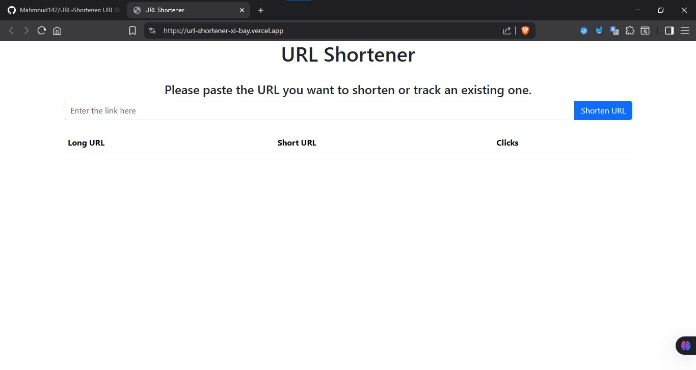

# URL Shortener

## Overview
A lightweight and efficient URL shortener built with Node.js, Express.js, and MongoDB Atlas. Users can shorten long URLs, share them, and track click analytics. The project features rate limiting, input validation, and a simple web interface.

## 🌐 Live Demo
Try the deployed app here: [https://url-shortener-xi-bay.vercel.app/](https://url-shortener-xi-bay.vercel.app/)
## 📂 Project Structure

```bash
URL-Shortener/
│-- config/
│   └── db.js                # Database connection setup
│-- controllers/
│   └── url.controller.js    # Business logic for URL operations
│-- middlewares/
│   ├── asyncWrapper.js      # Async error handling middleware
│   └── validator.middleware.js # Validation middleware
│-- models/
│   └── shortUrl.model.js    # Mongoose schema/model for URLs
│-- routes/
│   └── url.routes.js        # API endpoints for URL operations
│-- utils/
│   └── url.validator.js     # URL validation logic
│-- views/
│   └── index.ejs            # Frontend template
│-- server.js                # Main entry point (Express server)
│-- package.json             # Project metadata and dependencies
│-- vercel.json              # Vercel deployment config
│-- page-image.jpg           # Screenshot preview
│-- README.md                # Project documentation
│-- .env                     # Environment variables (not committed)
│-- .gitignore               # Git ignore file
```

## 📸 Screenshot


## 🚀 Getting Started

### 📌 Prerequisites
- [Node.js](https://nodejs.org/) installed
- [MongoDB Atlas](https://www.mongodb.com/atlas) account

### 🔧 Installation
Follow these steps to set up the project locally:


1. **Clone the repository**
   ```bash
   git clone https://github.com/Mahmoud142/URL-Shortener.git
   ```
2. **Navigate to the project directory**
   ```bash
   cd URL-Shortener
   ```
3. **Install dependencies**
   ```bash
   npm install
   ```
4. **Create a `.env` file in the root directory and add your MongoDB Atlas connection string:**
   ```env
   DB_URL=your_mongodb_atlas_connection_string
   ```

## ⚡ Usage

1. **Start the server**
   ```bash
   npm run dev
   # or
   node server.js
   ```
2. **Open your browser and go to:**
   [http://localhost:3000/](http://localhost:3000/)

## 🌟 Features
- Shorten long URLs
- Track number of clicks for each short URL
- Input validation and error handling
- Rate limiting to prevent abuse
- Simple web interface (Bootstrap)
- MongoDB Atlas for cloud database
- Ready for deployment on Vercel

## 🤝 Contributing

Contributions are welcome! Feel free to fork this repository, make improvements, and submit a pull request.

