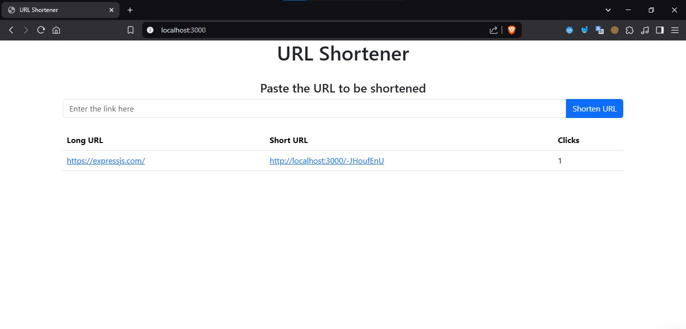

# URL Shortener

## overview
A lightweight and efficient URL shortener built using Node.js, Express.js, and MongoDB Atlas. This service enables users to shorten long URLs, share them easily, and track click analytics.

## 📂 Project Structure

```bash
url-shortener/
│-- config/
│   └── db.js            # Database connection setup
│-- controller/
│   └── url.controller.js # Handles business logic for URL operations
│-- models/
│   └── url.model.js      # Mongoose schema/model for storing URLs
│-- routes/
│   └── url.routes.js     # Defines API endpoints for URL operations
│-- views/
│   └── index.ejs         # Frontend template for rendering pages
│-- node_modules/         # Dependencies (ignored in Git)
│-- .env.example          # Example environment file (safe to upload)
│-- .gitignore            # Ignore node_modules, env files
│-- package.json          # Project metadata and dependencies
│-- package-lock.json     # Lock file for dependencies
│-- server.js             # Main entry point (starts Express server)
│-- url-image.jpg         # Example image for documentation
```
## 📸 Screenshot


## 🚀 Getting Started

## 📌 Prerequisites
Before you begin, ensure you have the following installed on your system:
- **[Node.js](https://nodejs.org/)** installed on your local machine.
- **[MongoDB Atlas](https://www.mongodb.com/atlas)** account for database hosting.

## 🔧 Installation
Follow these steps to set up the project locally:

1. **Clone the repository**  
   ```bash
   git clone https://github.com/Mahmoud142/URL-Shortener.git
2. **Navigate to the project directory**  
   ```bash
   cd url-shortener
3. **Install dependencies**  
   ```bash
   npm install
3. **Create a `.env` file in the root directory and add your MongoDB Atlas connection string as `DB_URL`**  
   ```bash
   touch .env

